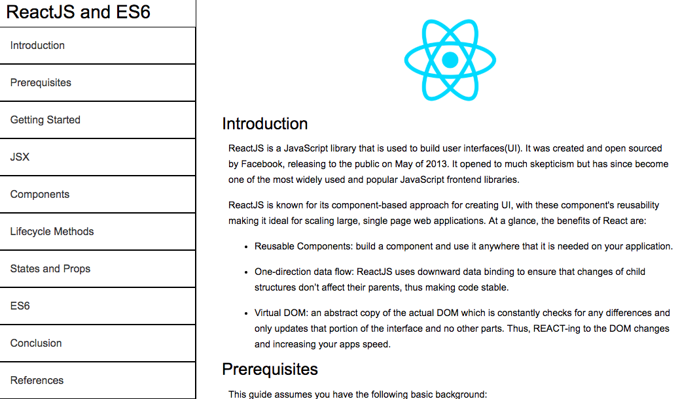

# ReactJS-And-ES6-Documentation
Documentation for ReactJS and ES6. Originally created in codepen.io and developed while completing freecodecamp. Could be seen [here](https://codepen.io/ej-sanmartin/pen/eLgQpQ)

Editing and adding to this documentation to further sharpen my skills in ReactJS as well as teach other developers how to use the UI library. I, also, plan to deploy on Heroku and AWS so the documentation is not confined to the limitations of "hosting" on codepen.

